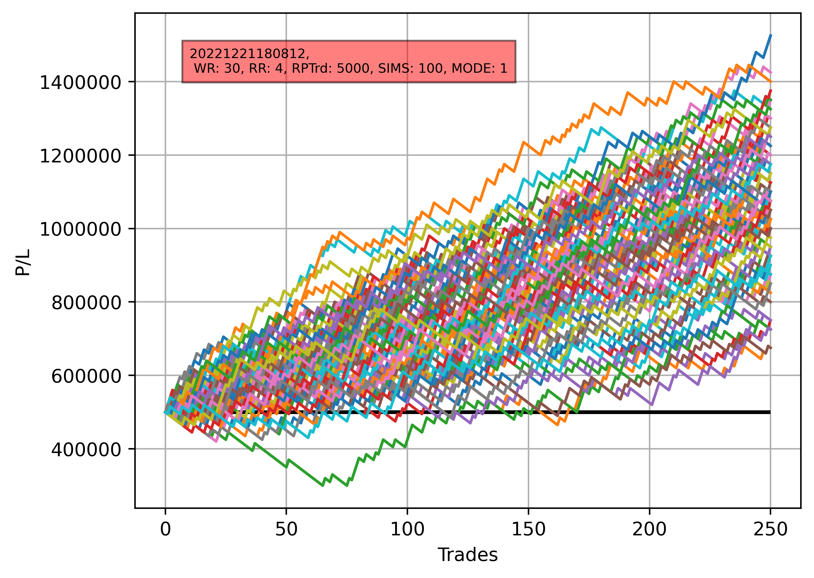

# Risk-Reward Simulator 

This is a program to demonstrate the various equity-growth outcomes of a trading strategy with a given win-rate and risk-reward ratio. It helps analyze back-tested strategies based on their risk-reward ratio, win rate %, total capital and risk per trade. 

The following parameters are used : 
Win Rate = 30%
Return : Risk = 4 : 1
Starting Capital = 500,000
Risk = 5,000 (1% of Starting Capital)

1. 250 random trades are generated so that every winning trade earns 4 times more than every losing trade loses. 
2. Out of the 250 trades, on a random basis 30% are winning trades. 
3. Each colored line plotted on the graph represents the journey of one such simulation.
4. In total, 100 such simulations are run. 
5. We can observe that for the above set of parameters, all the simulations end up in the positive zone, greater than the starting capital - despite initial drawdowns for some of the simulations. 
6. This tool allows you to observe the importance and relationship between "Win Rate" and "Risk : Return". 

## Sample Output : 

